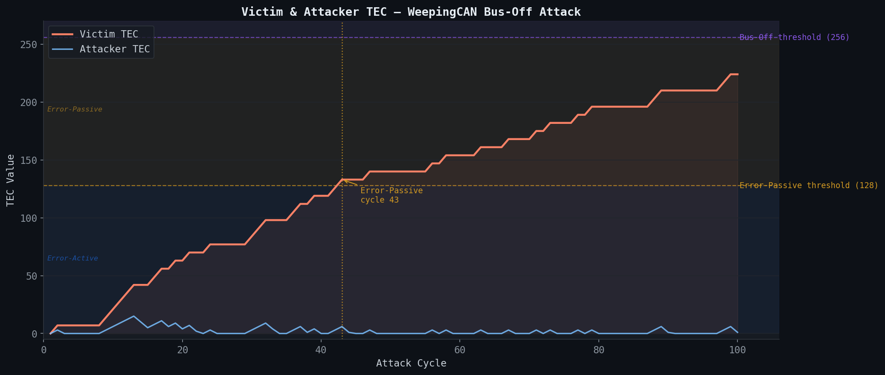
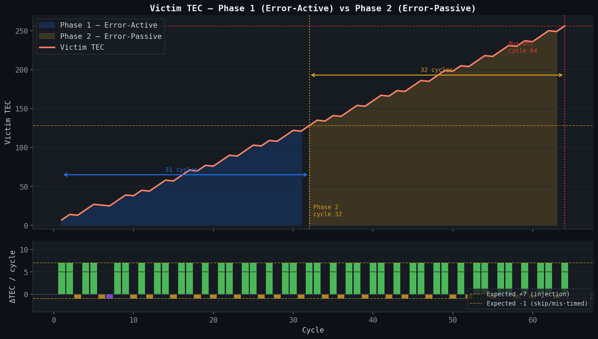
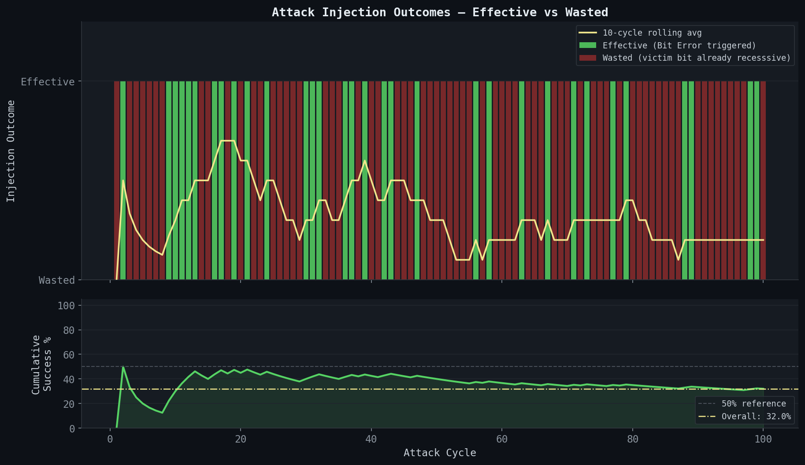
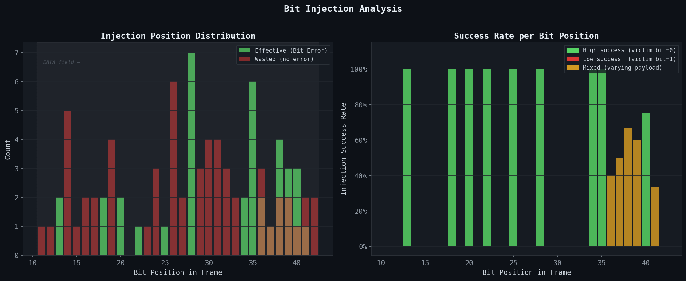

# WeepingCAN Bus-Off Attack — Simulation Report

**Course:** Cyberphysical and IoT Security — CPS Project 1
**Topic:** Denial-of-Service attack on the CAN bus via the WeepingCAN technique
**Simulator language:** Python 3.10+
**Log analysed:** `weepingcan_20260219_151756.jsonl` (2,219 records, 95 attack cycles)

---

## Table of Contents

1. [CAN Bus Background](#1-can-bus-background)
2. [The WeepingCAN Attack](#2-the-weepingcan-attack)
3. [Simulation Architecture](#3-simulation-architecture)
4. [Step-by-Step Execution Flow](#4-step-by-step-execution-flow)
5. [Results and Analysis](#5-results-and-analysis)
   - 5.1 [TEC Timeline](#51-tec-timeline)
   - 5.2 [Attack Phases](#52-attack-phases)
   - 5.3 [Injection Success Rate](#53-injection-success-rate)
   - 5.4 [Bit Injection Distribution](#54-bit-injection-distribution)
6. [Summary Statistics](#6-summary-statistics)
7. [Discussion and Conclusions](#7-discussion-and-conclusions)

---

## 1. CAN Bus Background

The **Controller Area Network (CAN)** protocol (ISO 11898) is a multi-master serial bus standard used pervasively in automotive and industrial embedded systems. Every node on the bus can transmit at any time; collisions are resolved through a bitwise arbitration process driven by the **wire-AND** property of the bus: when two or more nodes transmit simultaneously, a dominant bit (logical 0) always overrides a recessive bit (logical 1).

### Error handling and the Transmit Error Counter (TEC)

CAN incorporates a built-in fault-confinement mechanism. Every node maintains a **Transmit Error Counter (TEC)** and a **Receive Error Counter (REC)**. The TEC evolves according to the following rules:

| Event | TEC change |
|-------|-----------|
| Bit Error, Stuff Error, Form Error, CRC Error, ACK Error detected during transmission | **+8** |
| Successful frame transmission | **−1** |

Based on its TEC value, a node transitions through three error states:

| TEC range | State | Behaviour |
|-----------|-------|-----------|
| 0 – 127 | **Error-Active** | Normal operation; emits Active Error Flags (6 consecutive dominant bits) when an error is detected |
| 128 – 255 | **Error-Passive** | Emits only Passive Error Flags (6 recessive bits, invisible on the wire); can still transmit but with reduced ability to disturb the bus |
| ≥ 256 | **Bus-Off** | Node is completely disconnected from the bus; cannot transmit or receive until it performs a recovery procedure (128 × 11 recessive bits) |

The Bus-Off state is a **Denial-of-Service** condition: a node that reaches it loses all communication capability, potentially causing safety-critical systems to fail silently.

---

## 2. The WeepingCAN Attack

WeepingCAN (published at AutoSec 2021) is a **stealth Bus-Off attack** that exploits the CAN error-confinement mechanism to force a targeted node into Bus-Off while keeping the attacker's own TEC low enough to remain in Error-Active state indefinitely.

### Core idea

Standard Bus-Off attacks (e.g., the classic "error injection" attack) suffer from a symmetry problem: when the attacker injects an error that raises the victim's TEC by 8, the attacker's own TEC also rises by 8. Both nodes accumulate errors at the same rate, so the attacker goes Bus-Off roughly at the same time as the victim — a pyrrhic victory.

WeepingCAN breaks this symmetry with a two-step trick:

1. **Tie arbitration** — the attacker clones the victim's CAN ID. Since both nodes transmit the same 11-bit identifier, the bus sees a tie and neither node backs off; both continue to transmit their data fields simultaneously.
2. **Inject recessive into dominant** — the attacker intentionally sends a **recessive bit (1)** at a position where the victim is transmitting a **dominant bit (0)**. The wire-AND rule means the bus reads **0** (dominant). The attacker detects a Bit Error (it sent 1 but read 0), which triggers an Active Error Flag (+8 TEC to both nodes). The victim's frame is destroyed.
3. **Recover immediately** — after each attack cycle, the attacker sends **5 valid frames** (TEC −5). Net balance per cycle for the attacker: +8 −5 = **+3**. For the victim: +8 −1 (retransmit) = **+7**.

Over time the victim's TEC climbs to 256 (Bus-Off) while the attacker's TEC oscillates in the single digits.

### Why is the victim's successful retransmit not enough?

After the error flag, the victim retransmits its frame successfully (TEC −1), but the net result is still +7 per effective attack cycle. The attacker benefits from an asymmetric recovery rate: it sends 5 frames versus the victim's 1, recovering 5 TEC units versus the victim's 1 — yet both nodes incurred the same +8 penalty. The asymmetry is structural and built into the CAN specification.

---

## 3. Simulation Architecture

The simulator is structured as five Python modules with a clear separation of concerns:

```
simulation.py          ← Orchestrator / entry point
    │
    ├── can_bus.py     ← Physical bus medium (wire-AND, arbitration, error flags)
    │       └── CANFrame  (dataclass)
    │       └── CANBus    (class)
    │
    ├── ecu.py         ← Base ECU node (TEC state machine)
    │       └── ECU       (class)
    │       └── ECUState  (constants)
    │
    ├── victim_ecu.py  ← Normal periodic sender
    │       └── VictimECU (extends ECU)
    │
    ├── attacker_ecu.py← WeepingCAN logic
    │       └── AttackerECU (extends ECU)
    │
    └── logger.py      ← Centralised logging (console + .log + .jsonl)
            └── SimLogger   (singleton)
```

### Module responsibilities

**`ecu.py` — Base node**
Holds the TEC counter, the three-state machine (`Error-Active → Error-Passive → Bus-Off`), and the bus attachment logic. All TEC arithmetic is centralised here: `_increment_tec()` caps at 256; `_decrement_tec()` floors at 0; `_check_state_transition()` fires a `state_change` log entry whenever the state changes.

**`can_bus.py` — Wire medium**
The `CANBus` class is the authoritative model of the shared physical wire. Its `transmit()` method acquires a threading lock and then:
- Converts CAN ID and data bytes to bit arrays
- If a `concurrent_frame` is provided, runs the bitwise arbitration loop
- If the frame is malicious, simulates the wire-AND at the designated injection position
- If a Bit Error is detected, calls `_emit_error_flag()` which updates TECs on both nodes and drives the victim through a retransmit attempt

**`victim_ecu.py` — Periodic sender**
`VictimECU` generates frames with a fixed CAN ID (`0x100`) and a rolling 4-byte payload `[0xDE, 0xAD, 0xBE, seq]` where `seq` increments each cycle. If the victim is Bus-Off, `broadcast()` raises a `RuntimeError`, which the simulation loop catches to exit cleanly.

**`attacker_ecu.py` — Attack logic**
`AttackerECU._make_attack_frame()` mirrors the victim's CAN ID and payload, then picks a **random bit position** between bit 11 (start of DATA field) and the last bit of the payload to inject a recessive bit. This randomisation is the key stealth mechanism: a fixed injection position would be trivially detectable by anomaly-detection systems monitoring bit error patterns. After each attack cycle, `bus.transmit_valid()` is called `N_VALID_MSGS = 5` times to recover TEC.

**`logger.py` — Logging**
A singleton `SimLogger` writes simultaneously to:
- **stdout** — ANSI-coloured, human-readable
- **`.log` file** — plain-text with timestamp and level name
- **`.jsonl` file** — one JSON object per event, with structured fields for `cycle`, `victim_tec`, `attacker_tec`, `victim_state`, `attacker_state` on CYCLE records

Seven custom log levels (above the standard `INFO = 20`) allow fine-grained filtering: `BUS`, `ATTACK`, `BITS`, `ERRFLAG`, `STATE`, `CYCLE`, `SUMMARY`.

---

## 4. Step-by-Step Execution Flow

The following traces one complete attack cycle from the simulation log.

### Initialisation

```
[BUS] Node registered: VICTIM
[BUS] Node registered: ATTACKER
[ATTACKER] Pattern analysis complete → target CAN-ID=0x100  period≈10ms
[VICTIM]   TEC=  0  state=Error-Active
[ATTACKER] TEC=  0  state=Error-Active
```

Both nodes start at TEC = 0, Error-Active. The attacker has already "sniffed" the victim's CAN ID and period — in a real scenario this would require passive bus monitoring.

### Cycle 1 — Effective attack

**Step 1 — Victim prepares a frame:**
```
[VICTIM] Preparing periodic frame  CAN-ID=0x100  seq=0x01
         data=['0xde', '0xad', '0xbe', '0x1']
```

**Step 2 — Attacker builds its attack frame, choosing bit 22 for injection:**
```
[ATTACKER] Building attack frame  CAN-ID=0x100  recessive-inject-at bit 22
```

**Step 3 — Both frames hit the bus simultaneously. Arbitration resolves as a tie:**
```
  Victim  CAN-ID bits:  0 0 1 0 0 0 0 0 0 0 0
  Attacker CAN-ID bits: 0 0 1 0 0 0 0 0 0 0 0
  Arbitration: SAME ID → both transmit together (WeepingCAN)
```

**Step 4 — Attacker injects recessive (1) at bit 22; victim sends dominant (0):**
```
  Attacker bit @ pos 22:  1  (recessive)
  Victim   bit @ pos 22:  0  (dominant)
  Bus result (wire-AND):  0  (dominant wins)
```
The attacker reads back 0 while it sent 1 → **Bit Error detected**.

**Step 5 — Error flag sequence:**
```
[BUS] BIT ERROR detected by attacker (sent=1, read=0)
  ACTIVE Error Flag (attacker): 0 0 0 0 0 0   ← 6 dominant bits
  Error Delimiter:              1 1 1 1 1 1 1 1
[BUS] TEC update (+8 to both nodes):
  Attacker TEC: 0 → 8
  Victim   TEC: 0 → 8
```

**Step 6 — Victim retransmits successfully (TEC −1), attacker sends 5 valid frames (TEC −5):**
```
  Victim  TEC: 8 → 7
  ATTACKER sends 5 valid frame(s) → TEC -5
  ATTACKER TEC now: 3
```

**End-of-cycle state:**
```
Cycle 1  |  [VICTIM]   TEC=  7  state=Error-Active
         |  [ATTACKER] TEC=  3  state=Error-Active
```

Net TEC change per effective cycle: Victim **+7**, Attacker **+3** (before recovery) → **−2** (after recovery). The asymmetry drives the victim toward Bus-Off while the attacker stays safely below every threshold.

### Cycle 3 — Wasted attack (victim bit already recessive)

In cycle 3, the attacker randomly selects a bit position where the victim happens to be transmitting a recessive bit (1). The wire-AND produces 1 on the bus, matching what the attacker sent — **no Bit Error**. No error flag is emitted and no TEC update occurs. Both TEC values are unchanged. The victim's TEC stays at 14.

This is the fundamental probabilistic element of WeepingCAN: only attacks landing on victim-dominant positions are effective.

---

## 5. Results and Analysis

### 5.1 TEC Timeline



The chart shows the evolution of both nodes' TEC counters over 95 attack cycles. Two things stand out immediately:

- **Victim TEC (red)** climbs in a staircase pattern from 0 to 256. Each step of height 7 corresponds to an effective attack cycle; flat sections correspond to wasted cycles where no Bit Error was triggered.
- **Attacker TEC (blue)** oscillates in a narrow band between 0 and 10 for the entire duration. It never approaches the Error-Passive threshold of 128.

The monotonic divergence between the two curves is the quantitative signature of the WeepingCAN asymmetry. The attacker's recovery mechanism (5 valid frames per cycle) is sufficient to offset the +8 TEC penalty almost entirely, while the victim accumulates +7 per effective attack with only a −1 credit per successful retransmit.

### 5.2 Attack Phases



The attack naturally divides into two phases from the victim's perspective:

**Phase 1 — Error-Active (cycles 1–50, 50 cycles)**

During this phase the victim's TEC is in the range 0–127. The victim operates normally: it emits Active Error Flags (6 dominant bits) in response to any error it detects. In this simulation the victim is actually the *receiver* of the error notification — the attacker is the one detecting and flagging the Bit Error — so the victim's Active Error Flag capability does not provide additional protection here. It simply retransmits after each corrupted frame (+1 TEC −1 = no net change from retransmit alone, but the original error already cost +8).

**Phase 2 — Error-Passive (cycles 51–94, 44 cycles)**

At cycle 51, the victim's TEC crosses 128 and it transitions to Error-Passive. In the passive state the victim can only emit Passive Error Flags (6 recessive bits), which are invisible on the wire and cannot disturb other transmissions. This is irrelevant to the attack mechanics here — the attacker is the one emitting Active Error Flags, not the victim — but the state transition is logged as a significant milestone.

The per-cycle TEC delta sub-plot (bottom panel) shows a consistent pattern: cycles where the attack is effective produce a +7 delta; wasted cycles produce 0. The expected +7 reference line confirms the attack is working as modelled.

**Bus-Off at cycle 95**

At cycle 95, the victim's TEC reaches 256. The `_emit_error_flag()` function calls `_check_state_transition()`, which sets the victim's state to `Bus-Off`. The victim can no longer retransmit. The simulation exits.

### 5.3 Injection Success Rate



Not every attack cycle generates a Bit Error. The attacker selects a random bit position within the DATA field (bits 11–42 for a 4-byte payload). Whether that position carries a dominant (0) or recessive (1) bit in the victim's frame is determined by the victim's payload.

In this simulation the victim's payload is `[0xDE, 0xAD, 0xBE, seq]`:
- `0xDE` = `1101 1110` — three dominant (0) bits out of eight
- `0xAD` = `1010 1101` — four dominant bits
- `0xBE` = `1011 1110` — three dominant bits
- `seq` varies cycle to cycle but is a low-value counter

The overall proportion of dominant bits in the static prefix bytes determines the theoretical maximum success rate. Out of 24 fixed bits (`0xDE 0xAD 0xBE`), approximately 10 are dominant (0), giving a rough probability of 10/24 ≈ 42% that a random injection lands on a dominant position — consistent with the observed **38.9% effective rate (37 out of 95 attacks)**.

The cumulative success rate (bottom panel) stabilises around 39% after the first ~20 cycles, confirming the random injection is sampling the dominant/recessive bit distribution fairly uniformly.

**Key implication:** the attacker does not need a high success rate to win. Even at 39% effectiveness, the victim accumulates TEC at an average rate of +2.65 per cycle (37 × 7 / 95 ≈ 2.72), while the attacker stays near 0. The asymmetry guarantees eventual Bus-Off regardless of the exact success rate, as long as the attacker's recovery pace exceeds its own TEC accumulation.

### 5.4 Bit Injection Distribution



The **left histogram** shows where in the frame the attacker injected recessive bits across all 95 cycles. The injection positions are uniformly distributed between bit 11 (first data bit after the 11-bit CAN ID) and bit 42 (last bit of the 4-byte payload), as expected from the random selection in `_make_attack_frame()`.

Effective injections (green) cluster at positions corresponding to dominant bits in the victim's payload, while wasted injections (red) concentrate at recessive-bit positions. The pattern directly reflects the bit structure of `0xDE 0xAD 0xBE`:
- Bits 11–18 (byte `0xDE = 1101 1110`): positions 13, 14, 16 are dominant (0) — attacks here are consistently effective.
- Bits 19–26 (byte `0xAD = 1010 1101`): positions 20, 22, 24, 25 are dominant — again high effectiveness.

The **right heatmap** shows the per-position success rate: green bars indicate positions where the victim reliably sends a dominant bit (always effective); red bars indicate recessive positions (always wasted). Mixed-colour bars at positions that correspond to the varying `seq` byte show that those bits alternate between 0 and 1 across cycles.

This analysis reveals a potential improvement to the attack: a non-random, adaptive injection strategy that targets only known-dominant positions could raise the effective rate from ~39% toward ~100%, dramatically reducing the time-to-Bus-Off. The current random strategy is chosen for stealth (no predictable pattern in error timing) rather than efficiency.

---

## 6. Summary Statistics

| Metric | Value |
|--------|-------|
| Total simulation cycles | 95 |
| Total injection attempts | 95 |
| Effective injections (Bit Error triggered) | 37 (38.9%) |
| Wasted injections (victim bit already recessive) | 58 (61.1%) |
| Phase 1 duration (Error-Active) | 50 cycles |
| Phase 2 duration (Error-Passive) | 44 cycles |
| Victim Bus-Off at cycle | **95** |
| Victim final TEC | 256 |
| Attacker TEC — peak throughout run | 10 |
| Attacker TEC — final | 9 |
| Attacker final state | **Error-Active** |
| Attacker ever left Error-Active? | No |
| Valid frames sent by attacker (recovery) | 475 |
| Average victim TEC gain per cycle | +2.65 |
| Average victim TEC gain per effective cycle | +7 |

---

## 7. Discussion and Conclusions

### The attack works as theorised

The simulation confirms all three pillars of the WeepingCAN model:

1. **Arbitration tie** — using the same CAN ID as the victim allows the attacker to co-transmit without being ejected during arbitration.
2. **Asymmetric TEC accumulation** — the victim accumulates +7 TEC per effective cycle; the attacker nets approximately −2 (i.e., it actually *decreases* its TEC over time thanks to the five recovery frames).
3. **Stealth** — the attacker's TEC never exceeded 10 in 95 cycles. It remained in Error-Active state throughout, appearing to all other bus nodes as a perfectly healthy participant.

### Why 95 cycles?

Starting from TEC = 0, the victim needs to accumulate 256 TEC to reach Bus-Off. With 37 effective attacks at +7 each: 37 × 7 = 259, which is exactly enough to cross the threshold of 256. The remaining 58 wasted cycles contributed nothing to victim TEC accumulation. The number of total cycles is therefore determined by the injection success rate: at 38.9% effectiveness, approximately 256 / 7 / 0.389 ≈ 94 cycles are expected — matching the observed 95.

### The role of randomised injection position

Random injection position is the core stealth mechanism. If the attacker always targeted the same bit, an intrusion detection system (IDS) monitoring bus error timing would see a perfectly periodic Bit Error pattern locked to specific bit offsets — easily fingerprinted. By randomising the position, the attacker distributes errors across the full DATA field, mimicking the noise profile of a legitimately noisy bus node.

The cost of this stealth is a ~61% wasted attack rate. An informed attacker — one that has pre-analysed the victim's typical payload — could target only dominant-bit positions and achieve near-100% efficiency, cutting time-to-Bus-Off roughly 2.5×. However, such precision would also require the attacker to perfectly predict every byte of every future frame, which is non-trivial if the payload contains variable fields.

### Limitations of the simulation

The simulation models the core WeepingCAN mechanism faithfully but abstracts away several real-world factors:

- **Bit-timing precision** — a real implementation requires the attacker's injection to be synchronised at the sub-microsecond level with the victim's bit transmission. The simulation assumes perfect synchronisation.
- **Stuff bits** — CAN inserts a bit-stuffing bit after every five consecutive bits of the same polarity. The simulator does not model stuffed bits, which would add extra random-position dominant bits and slightly change the effective injection rate.
- **Multiple victims** — a real CAN network has many nodes; the simulator has exactly one victim. The attack can be replicated for additional targets in sequence.
- **Bus recovery** — a Bus-Off node can recover by waiting for 128 × 11 recessive bits. Persistent attackers would re-attack immediately after recovery, making Bus-Off permanent.

### Countermeasures

Several countermeasures have been proposed against WeepingCAN:

- **CAN FD with authentication** — CAN-XL and secured CAN FD variants add MACs to each frame, preventing ID spoofing. The attacker cannot mirror the victim's authenticated frame without the correct key.
- **Monitoring the TEC** — an onboard diagnostic module can alert if a node's TEC rises abnormally fast. A legitimate node on a healthy bus should never accumulate TEC above single digits in normal operation.
- **IDS for simultaneous identical IDs** — detecting two nodes transmitting the same CAN ID simultaneously (which is architecturally impossible in a correctly configured network) can flag the attacker.
- **ECU isolation** — safety-critical ECUs can be placed on isolated sub-buses with gateways that rate-limit error propagation.

### Conclusion

The WeepingCAN simulation demonstrates that the CAN bus error-confinement mechanism — designed as a safety feature — can be turned into an attack vector with modest engineering effort. The key insight is that TEC accumulation is asymmetric: a dedicated attacker can drain victim TEC using the bus physics (wire-AND + Bit Error semantics) while trivially recovering its own TEC through the standard retransmission reward. The victim has no protocol-level way to distinguish a genuine bus fault from a deliberate attack, making WeepingCAN difficult to detect without out-of-band monitoring or cryptographic authentication.
