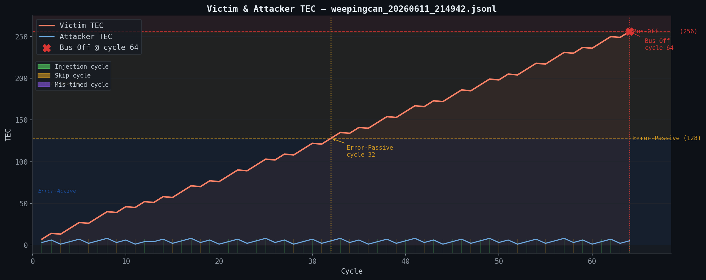
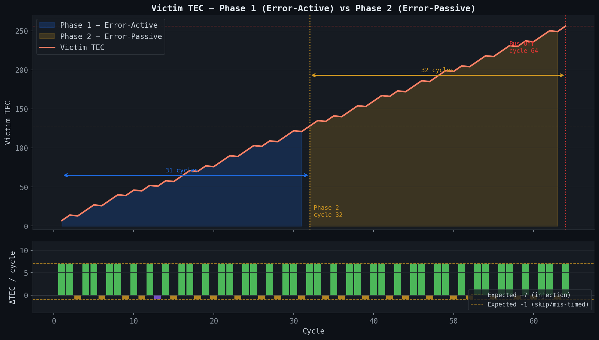
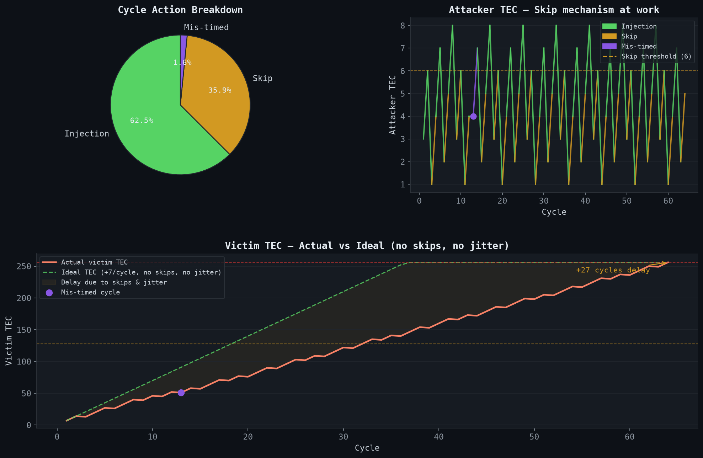
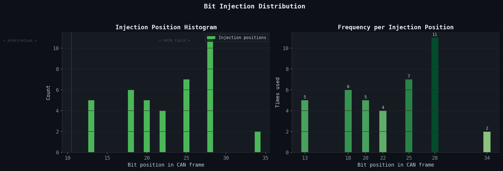
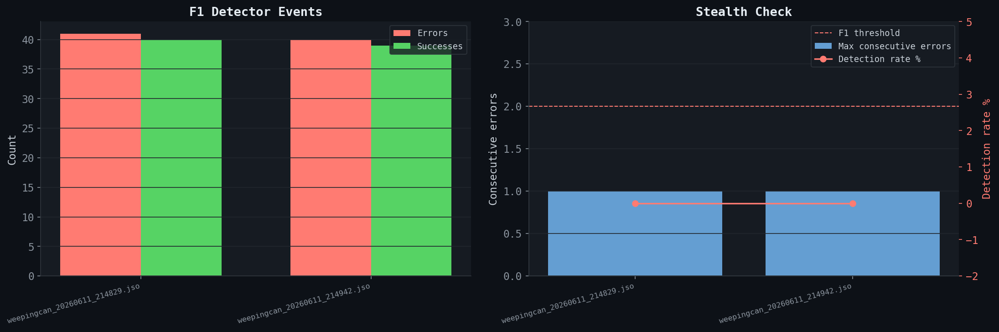

# Report for the Course on Cyber-Physical Systems and IoT Security

## Title of the reference paper

**WeepingCAN: A Stealthy CAN Bus-off Attack**

Reference paper by Gedare Bloom, University of Colorado Colorado Springs.

The paper describes a stealthier version of the CAN bus-off attack. Instead of
creating long runs of repeated errors, the attacker corrupts selected victim
frames and then lets a clean transmission happen before the detector sees a
second consecutive error.

## Name of who is involved in the project

**Alessandro Vulcu**

Course project: CPS Project 1, Cyber-Physical Systems and IoT Security.

## Objectives

For this project I wanted to reproduce the main WeepingCAN idea in software:
force one ECU into Bus-Off while the attacker stays Error-Active.

The project goals were:

- simulate CAN arbitration and dominant/recessive wire behavior;
- model TEC updates and the Error-Active, Error-Passive, and Bus-Off states;
- create a periodic victim ECU;
- create an attacker ECU that mirrors the victim CAN ID and injects recessive
  bits in dominant positions;
- add attacker recovery with valid frames;
- add skip cycles and timing jitter, so the model is not unrealistically
  perfect;
- add the F1 detector described in the paper and check whether it fires;
- analyze the JSON logs in a Jupyter notebook.

## System Setup

I did not use physical CAN hardware. The testbed is a Python simulator written
for this project. It does not try to be a full CAN controller. It only models
the behavior needed for this attack: 11-bit IDs, data bits, arbitration ties,
wire-AND resolution, error flags, TEC counters, and state transitions.

Main files:

- `simulation.py`: starts and runs the experiment;
- `can_bus.py`: simulates arbitration, wire-AND behavior, frame delivery, and
  error flags;
- `ecu.py`: contains the TEC counter and ECU state machine;
- `victim_ecu.py`: sends the periodic victim frame with CAN ID `0x100`;
- `attacker_ecu.py`: implements the attack, jitter, skip logic, and recovery;
- `detector.py`: implements the F1 detector;
- `logger.py`: writes console, `.log`, and `.jsonl` output;
- `Notebook/weepingcan_analysis.ipynb`: parses logs and builds the plots.

The simulator itself uses Python 3.10+ and the standard library. The notebook
uses `numpy`, `pandas`, and `matplotlib`.

The victim payload is:

```python
[0xDE, 0xAD, 0xBE, seq]
```

`seq` is an 8-bit counter. Before attacking, the attacker assumes the static
part of the payload is known and uses these dominant-bit positions:

```python
SAFE_INJECT_POSITIONS = [13, 18, 20, 22, 25, 28, 34]
N_VALID_MSGS = 5
SYNC_ERROR_PROBABILITY = 0.05
SKIP_TEC_THRESHOLD = 6
```

## Experiments

I ran the simulator until the victim reached Bus-Off or the attacker left
Error-Active. The command used for fast runs was:

```bash
python simulation.py --quiet --delay 0
```

The simulator stores structured logs in `logs/`. The two runs used in this
report are:

```text
logs/weepingcan_20260611_214942.jsonl
logs/weepingcan_20260611_214829.jsonl
```

The notebook used for analysis is:

```text
Notebook/weepingcan_analysis.ipynb
```

Cycle flow:

1. The victim prepares a frame with CAN ID `0x100`.
2. If the attacker's TEC is below `SKIP_TEC_THRESHOLD`, it attacks. Otherwise it
   skips the attack and only sends valid frames to drain TEC.
3. During an attack, the attacker sends the same CAN ID as the victim. The
   arbitration phase ends in a tie.
4. The attacker injects a recessive bit where the victim should be sending a
   dominant bit.
5. If jitter occurs, the injection is counted as mis-timed and no bit error is
   produced.
6. If the injection lands correctly, the attacker detects a Bit Error and emits
   an error flag. Both TEC counters increase by 8.
7. If the victim is not already Bus-Off, it retransmits successfully and reduces
   its TEC by 1. Net victim cost: `+7`.
8. The attacker sends five valid frames, reducing its own TEC by 5.
9. The F1 detector records errors and clean transmissions for the CAN ID. Its
   threshold is two consecutive errors.

The notebook generates these plots:

- `Notebook/plot_tec_timeline.png`
- `Notebook/plot_phase_analysis.png`
- `Notebook/plot_success_rate.png`
- `Notebook/plot_injection_dist.png`
- `Notebook/plot_f1_detector.png`

## Results and Discussion

### Main run

Main log: `logs/weepingcan_20260611_214942.jsonl`.

| Metric | Value |
|---|---:|
| Total cycles | 64 |
| Attack cycles | 41 |
| Effective error events recorded by F1 detector | 40 |
| Skip cycles | 23 |
| Mis-timed cycles | 1 |
| Error-Passive starts | cycle 32 |
| Victim Bus-Off | cycle 64 |
| Victim final TEC | 256 |
| Attacker peak TEC | 8 |
| Attacker final TEC | 5 |
| Attacker final state | Error-Active |
| Valid attacker recovery messages | 315 |
| F1 max consecutive errors | 1 |
| F1 events | 0 |
| F1 detection rate | 0.0% |

The attack worked in this run. The victim reached TEC 256 at cycle 64 and went
Bus-Off. The attacker stayed far below the Error-Passive threshold of 128. Its
highest TEC was only 8.

One attack cycle was mis-timed, which is why the run has 41 attack cycles but
only 40 F1 error events. That is exactly the kind of imperfection I wanted the
simulator to include.

### Repeatability

I compared the main run with another run from the same simulator version:

| Run | Bus-Off cycle | Attack cycles | Skip | Mis-timed | Attacker peak TEC | F1 max run | F1 events |
|---|---:|---:|---:|---:|---:|---:|---:|
| `weepingcan_20260611_214942.jsonl` | 64 | 41 | 23 | 1 | 8 | 1 | 0 |
| `weepingcan_20260611_214829.jsonl` | 68 | 45 | 23 | 4 | 8 | 1 | 0 |

The second run took four more cycles because it had more mis-timed injections.
That result makes sense: jitter does not stop the attack, but it slows it down.
Both runs still reached Bus-Off, and in both runs the F1 detector stayed quiet.

### Figures



The TEC timeline is the clearest result. The victim climbs to 256, while the
attacker stays below 10. Skip cycles keep pulling the attacker's TEC back down.



The victim becomes Error-Passive around cycle 32 and reaches Bus-Off at cycle
64. Effective attacks add about `+7` TEC to the victim. Skip and mis-timed
cycles delay that growth.



This plot shows why the attack does not follow the ideal line. The ideal case
assumes no skip cycles and no jitter. The actual run is slower, but the attacker
is much safer.



The attacker does not choose arbitrary data bits. It uses the static payload
analysis and targets the known dominant-bit pool. This makes the simulator more
efficient than a fully random injector.



This plot checks the detector directly. The maximum consecutive-error run is 1,
below the F1 threshold of 2. The detector therefore reports no F1 events and a
0.0% detection rate.

### Discussion

The simulation reproduced the part of WeepingCAN that mattered for this project:
same-ID co-transmission, recessive-bit injection, CAN wire-AND behavior,
asymmetric TEC growth, attacker recovery, skip cycles, jitter, and the F1
stealth check.

The core reason the attack works is simple. During an effective cycle, both
nodes first get `+8` TEC because of the error. The victim then gets only `-1`
from a clean retransmission. The attacker sends five clean frames and gets
`-5`. Over time, the victim moves toward Bus-Off while the attacker stays near
zero. The skip threshold is a practical guardrail: if the attacker TEC gets too
high, it skips a cycle and recovers.

The F1 detector does not catch this behavior because it looks for consecutive
errors on the same CAN ID. WeepingCAN breaks that pattern. After each effective
error, the victim retransmits cleanly, so the detector's counter resets before
it reaches 2.

This is still a software model, not a hardware replication of the paper. The
simulator does not include real CAN controller timing, physical-layer
fingerprints, bit stuffing, other ECUs on the bus, or real Bus-Off recovery.
Those details matter in a vehicle. Here the goal was narrower: check whether
the logic of the attack and the F1 evasion can be reproduced in a controlled
setting.

For that goal, the result is positive. The victim reaches Bus-Off, the attacker
remains Error-Active, and the implemented F1 detector does not fire. What this
does not prove is that the same code would work unchanged on real CAN hardware.
It shows why the attack is plausible and why F1 alone is not enough.
