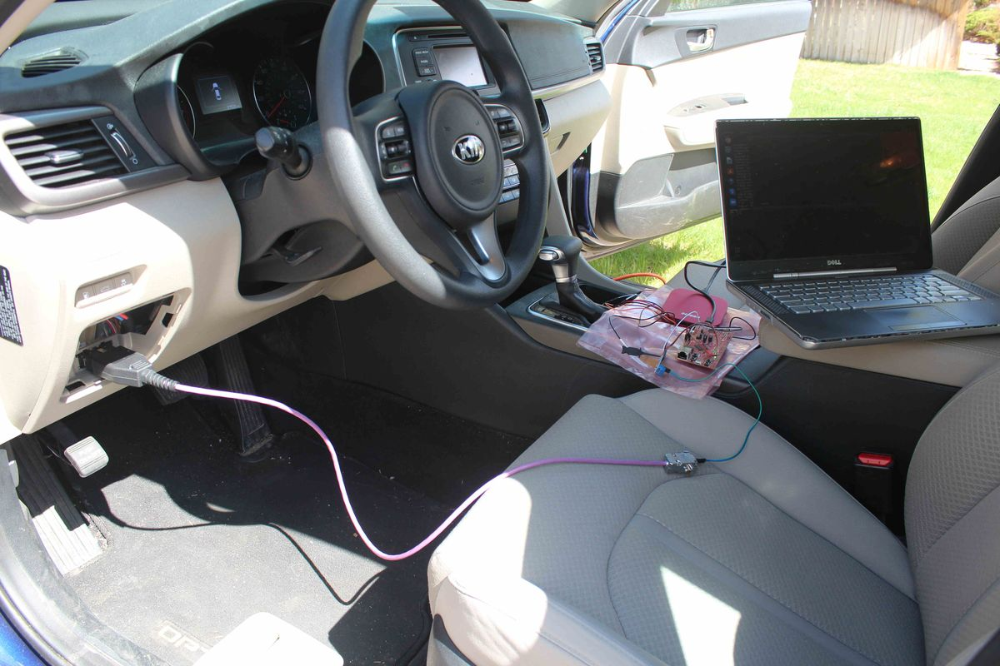

<!-- Pagina 1 -->

WeepingCAN: A Stealthy CAN Bus-off Attack

Gedare Bloom
University of Colorado Colorado Springs
gbloom@uccs.edu

Abstract—The controller area network (CAN) is a high-value asset to defend and attack in automobiles. The bus-off attack exploits CAN’s fault confinement to force a victim electronic control unit (ECU) into the bus-off state, which prevents it from using the bus. Although pernicious, the bus-off attack has two distinct phases that are observable on the bus and allow the attack to be detected and prevented. In this paper we present WeepingCAN, a refinement of the bus-off attack that is stealthy and can escape detection. We evaluate WeepingCAN experimentally using realistic CAN benchmarks and find it success in over 75% of attempts without exhibiting the detectable features of the original attack. We demonstrate WeepingCAN on a real vehicle.

I. INTRODUCTION

Motor vehicles are complex cyber-physical systems (CPS) with more software on more electronic control units (ECUs) coupled by expansive in-vehicle networks. Increasing complexity provides ubiquitous connectivity for autonomous driving and infotainment but comes with opportunities to exploit vulnerabilities in the networks and ECUs [1], [3], [4], [10], [16], [22], [25], [30]. These exploits motivate authentication and intrusion detection systems (IDSs) [17], [19], [21], [24], [26]–[28], [31], [38]–[40] especially in the controller area network (CAN) because it is used in the majority of vehicles.

A noteworthy attack on CAN is the bus-off attack discovered by Cho and Shin [4]. This attack leverages CAN’s fault confinement mechanism to cause an ECU to enter the bus-off state, which removes its access to the bus. The attack, while interesting, exhibits features that make it easily detectable.

In this paper, we introduce a novel bus-off attack that is stealthy—it does not provide an obvious feature for detection. We call this attack WeepingCAN. We make the following contributions with this paper:

1) exposition of WeepingCAN;
2) a skipping attack strategy to increase success;
3) and empirical evaluation of performance and stealthiness.

WeepingCAN is able to bus-off an ECU with success rates above 75% and low detectability.

Threat Model: Consistent with prior CAN attacks [3], [4], [10], [16], [30], we assume an adversary ($A$) controls the software on a compromised ECU. $A$ can execute arbitrary code and can send/receive arbitrary messages on the CAN bus. Arbitrary code execution implies that $A$ can reprogram CAN controller registers and interrupt handlers. Although the exploit to compromise an ECU is out of scope, ECUs are known to be vulnerable via multiple surfaces [3], [16], [36].

$A$’s goal is to cause a victim ECU ($V$) to enter the bus-off state while $A$ remains stealthy to escape detection. We assume $A$ conducted an offline analysis and knows the CAN message parameters [9], [10], [18], [26], [28], [29], [37]. We expect $A$ can determine the vehicles that satisfy the threat model.

Fault Model: To simplify the attack analysis, we assume the CAN bus does not incur faults. In reality, faults may increase or decrease the success of attacks and countermeasures.

II. BACKGROUND AND RELATED WORK

We refer interested readers to Natale et al. [23] and Hu [13] for in-depth coverage of CAN and its error handling.

A. CAN Overview

CAN is a multi-leader broadcast bus with decentralized arbitration based on the sender’s identifier (ID). Logic-0 bits are encoded as a dominant signal and logic-1 as a recessive signal. All nodes float recessive to transmit a 1 and drive a dominant signal to transmit 0.

A few of the basic CAN data frame’s fields are relevant to the bus-off attack. The data field can be between 0 and 8 bytes, and sends encodes its size in the 4-bit data length code (DLC) field. The ID field can be 11 or 29 bits. Other fields are not used explicitly by the attack.

CAN’s error handling is central to the bus-off attack. Each node can be in one of three states—error-active, error-passive, and bus-off—depending on the values of its receive error counter (REC) and transmit error counter (TEC). A node increases its REC by 1 for each error observed while not transmitting, and its TEC by 8 for each error while transmitting. Each successful receive (transmit) decrements the REC (TEC) by 1. Each node that detects an error transmits an error-active (error-passive) flag of six dominant (recessive) bits in the error-active (error-passive) state. Fig. 1 shows the state machine that governs how the node states change based on the TEC/REC.

B. Original Bus-off Attack

$A$ identifies some periodic message $v$ that $V$ transmits. $A$ fabricates two messages: a preceded and an attack message.

---

<!-- Pagina 2 -->

1) Preceded Messages (IDs): The preceded message of $v$ is some message that transmits immediately before $v$. Sometimes $A$ can use an authentic message as a genuine preceded ID of $v$. The attack success rate can go from below 1% to above 90% by using preceded messages [4].

2) Attack Message ($v_A$): The attack message $v_A$ has the same ID as $v$ and an identical bit-wise prefix up to some bit at which $v$ is recessive and $v_A$ is dominant.

3) Attack Cycle: The attack proceeds in two phases:
   - **Phase 1:** $A$ synchronizes with $V$ by enqueuing the preceded message and the attack message isochronously with $v$ but at a small negative offset, $v_A$ and $v$ transmit in tandem, which causes a bit error and both ECUs increment their TEC by 8. They also retransmit synchronously, thus repeating the error in a cascade of retransmissions. On the 15th retransmission (16th transmission), both ECUs reach TEC=128 and enter the error passive state before retransmitting again.
   - **Transition:** On the 17th transmission, $V$'s TEC increases by 8 (to 136) and it transmits a passive error flag, which does not affect $A$. Thus, $A$ successfully transmits $v_A$ and decrements its TEC by 1 to reach 127 and re-enter the error active (normal) state. Then the retransmission of $v$ succeeds and $V$ decreases its TEC by 1. $V$ is in the error passive state with a TEC of 135, and $A$ in the error active state with a TEC of 127.
   - **Phase 2:** $A$ continues to inject messages synchronized with $v$ to increase $V$'s TEC by 7 and decrement its own TEC. This phase iterates with the period of $v$. Eventually $V$'s TEC reaches 255 putting it in bus-off.

C. Bus-off Attack Countermeasures

Cho and Shin [4] identified two features that make detecting the bus-off attack possible: **feature F1** occurs in Phase 1 when a message encounters consecutive errors; **feature F2** happens in Phase 2 when the victim observes a successful message over its passive error flag. The authors described a two-pronged countermeasure in which a node that observes F1 followed by F2 determines a bus-off attack is in progress. Others have used the same approach [32], [33].

1) Detection: Physical-layer IDSs may detect the bus-off attack due to differences in the physical characteristics of $A$'s and $V$'s hardware [5]-[7], [11], [15], [41]. These IDSs generally require additions to a bus, and methods exist to confuse or circumvent them [10], [30].

2) Prevention: Secure hardware [8], [12], [20], may prevent the attack by detecting and blocking the local transmission of $v_A$. However, an attacker with access to even one node allows arbitrary message transmissions may still conduct the bus-off attack.

MAuth-CAN [14] is a CAN bus authentication mechanism that protects the authenticator by using two CAN interfaces and switching from one to the other in case the TEC exceeds 96. This approach is unlikely to be generalized because it would require every ECU to duplicate its CAN hardware.

III. ANATOMY OF THE ATTACK

WeepingCAN is a variation of the original bus-off attack with a few critical differences, namely: (i) $A$ disables retransmission of $v_A$; (ii) $A$ causes recessive bit errors; (iii) $A$ does not fabricate preceded messages; (iv) $A$ randomizes the injected bit error. These differences enable the attack without the detectable features of the original.

A. Attack Message: $v_A$

The attack message has $v$'s ID, bit-time, and prefix bits until a random position where $v$ is $v_A$ is recessive.

B. Attack Cycle

Unlike the original attack, WeepingCAN does not exhibit behavioral differences due to the error state transitions. Initially $A$ and $V$ have a TEC of 0 in the error-active mode. WeepingCAN proceeds as follows:

1) $A$ synchronizes with $V$ using the periodic approach of the original attack.
2) $A$ disables retransmission of $v_A$.
3) $A$ injects the attack message $v_A$.
4) $A$'s CAN controller sends an error-active flag due to the bit error in $v_A$ that increases $A$'s and $V$'s TEC by 8.
5) $V$ retransmits $v$ and decrements its TEC by 1.
6) $V$ and $A$ decrease their TECs by 1 for other transmissions.

C. Disable Retransmission of $v_A$

Step 2 of the attack aims to avoid feature F1. The effect of disabling retransmission of $v_A$ is that the attack is characterized by active error flags followed by successful transmissions. We have found two ways to disable $v_A$'s retransmission: (i) Disable automatic retransmissions for all messages; (ii) Abort transmission on transmit error.

1) Disable Automatic Retransmissions for All Messages: Many commercial CAN controllers can disable automatic message retransmissions for use with time-triggered CAN (TTCAN) applications. Prior to injecting $v_A$, $A$ disables automatic retransmission by writing to a control register, which typically affects all messages handled by the CAN controller. Disabling automatic retransmissions also disables retransmissions due to losing arbitration, so the injection of $v_A$ must occur exactly during the transmission of the message that precedes $v$ so that $v$ and $v_A$ both win arbitration together.

2) Abort Transmission on Transmit Error: Most CAN controllers can raise an interrupt on transmit errors and allow $A$ to abort retransmission in the interrupt handler.

---

<!-- Pagina 3 -->

D. Recessive Injection

$A$ injects a recessive (1) bit when $v$ contains a dominant (0), which causes $A$'s CAN controller to send an error flag and increment its TEC by 8. $V$ increments its TEC by 8 and attempts to retransmit. Since $A$ disabled retransmissions, the retransmission by $V$ will succeed, decrementing $V$'s TEC by 1. Unfortunately, disabling retransmissions means that $v_A$ never successfully transmits; the attack could actually put $A$ into bus-off! Instead, $A$ can identify additional messages it can transmit to keep its TEC less than $V$'s. $A$ needs to transmit at least 1 more message than $V$ for each $v_A$, and $V$ has to transmit fewer than 7 other messages or its TEC will recover.

Let $M$ be a set of messages, with $M_V$, $M_A$ the set of messages transmitted by $V$ and $A$, respectively. Let $m_T$ denote the period of $m \in M$. Then $A$ can keep its TEC beneath $V$'s if the following holds:

$$\exists v \in M_V \ s.t. 8 > \sum_{m' \in M_V} \frac{v_T}{m'_T} < \sum_{m \in M_A} \frac{v_T}{m_T}. \tag{1}$$

Example 1 (Basic Attack Strategy): Suppose $|M_V| = |M_A| = 1$, and $A$'s authentic message is sent with one-fifth the period of $V$'s. Eq. 1 holds as $8 > 1 < 5$. For every attack on $v \in M_V$, $A$ successfully transmits 5 messages and $V$ transmits 1 message; their TECs will increase by 3 and 7, respectively. Thus, $V$ can be forced to error passive with 19 attack messages, while $A$'s TEC only reaches 57. When $V$ reaches bus-off after 37 attack messages, $A$'s TEC reaches 116 and it remains error-active.

Skipping Injections: Subject to Eq. 1, $A$'s TEC grows slower than $V$'s, but $A$ can reach error-passive before $V$ reaches bus-off. For example, if $V$'s TEC grows by 7 and $A$'s grows by 6, then $A$'s TEC is 114 when $V$ enters error-passive on the 19th injection. However, $A$ becomes error-passive on the 22nd, and $A$ eventually goes to bus-off while $V$ recovers. $A$ can avoid going to bus-off by skipping some injections of $v_A$. Skipping every other injection will increase $V$'s TEC by 6 and $A$'s by 4, which still is not good enough. Injecting on every third message of $v$ increases $V$'s TEC by 5 and $A$'s by 2, which puts $V$ in bus-off on the 51st injection.

Example 2 (Skipping Attack Strategy): Consider the case when $|M_V| = |M_A| = 1$, and $A$'s message is sent with one-fourth the period of $V$'s. Eq. 1 holds as $8 > 1 < 4$. For every transmission of $v$ by $V$, $A$ will successfully transmit 4 messages and their TECs will increase by 7 and 4, respectively. If $A$ injects on every $v$, then $V$ goes to error passive with 19 attack messages, while $A$ would only reach a TEC of 76, but $A$ gets stuck in the error-passive state on the 31st attack injection before $V$ reaches bus-off, and the attack would fail. If instead $A$ injects every other $v$, skipping one iteration, $V$ would increase its TEC by 6 and $A$'s TEC would increase by 0 (fully recover) between attack injections. Thus, $V$ would reach error passive after 21 injections, and bus-off after 43.

E. Randomized Bit Positions

Creating a generalizable non-deterministic attack strategy is challenging because it depends on $A$'s ability to predict the bits of $v$. Despite this challenge, $A$ can employ simple heuristics to increase the variability of the bit-error position within the DLC and data fields of $v_A$. The DLC of most messages is a fixed constant that can be discovered by offline analysis of a CAN trace. The number of dominant bits in valid DLCs vary between 1 and 3, so the entropy for a random injection is low; a clever adversary will inject recessive errors in the data field.

The data field often encodes a number that does not change quickly because of physical constraints or an event identifier that comes from a limited set of events. Messages often repeat identically for long intervals. If $A$ can identify a deterministic pattern, then the recessive error can be injected in the data. Variation within the data field—or lack thereof—is vehicle-specific. Taylor et al. [34] found that one vehicle (2012 Subaru Impreza) used 20 IDs for which “many bits were observed to always be zero” that could reliably be used by $A$ to inject recessive errors.

IV. EVALUATION

We use a benchtop CAN bus and real vehicle for experimental validation of WeepingCAN using off-the-shelf hardware and in-house software. We conducted several experiments to evaluate the ideas presented in this paper.

A. Experimental Setup

The benchtop platform includes five microcontrollers—two BeagleBone Black (BBB), and three TM4C129EXL (TM4C) boards—that integrate hardware CAN controllers with the processor chip. We connect them to SN65HVD23x CAN transceivers that connect via 3.3V in a breadboard. We use a Saleae Logic Pro 16 to snoop the bus. We run custom normal workloads and attacker code.

1) Synthetic Benchmark: We adapt the Synthetic Benchmark from Cho and Shin [4] to reproduce some of their results. Specifically, we configure a 500 kbps CAN using three TM4C boards as nodes $X$, $V$, and $A$ to recreate their 3-node setup. Node $X$ sends message IDs 7 and 9 at a 10 ms period. Node $V$ sends message ID 17 when it receives ID 7 hence also at 10 ms period. Node $A$ is the attacker.

2) SAE Benchmark: As an intermediate step toward real vehicles we adopt a modified SAE Benchmark [35] with sporadic messages omitted. We define message priorities inversely to their periods and use constant valued data fields. We break ties (identical periods) by static prioritization of the subsystems as follows in decreasing priority order: Vehicle Controller (VC), Brakes, Battery, Driver, Inverter/Motor Controller (IMC), and Transmission (Trans). Table I shows the benchmark parameters. Note that, when the subsystems synchronize with each other, every message except A0 has at least one genuine preceded ID. In general, they only synchronize by happenstance.

To allocate the subsystems to boards in our benchtop setup, we analyze their suitability as both victim and attacker by calculating Eq. 1 for each combination of subsystem. The Battery, Brakes, and Trans subsystems can satisfy the role of victim. The VC, Driver, IMC, and Trans subsystems can be the attacker in decreasing order of preference. We place the VC, Driver, and Brakes on separate TM4Cs, IMC on its own BBB, and Battery and Trans together on another BBB.

---

<!-- Pagina 4 -->

3) F1 Attack Detector: We used the approach described by Cho and Shin [4] to identify consecutive errors (feature F1) as indicative of a bus-off attack. We report the performance of this F1 attack detector in each experiment except for the last experiment conducted with a real vehicle because we are unable to observe the internal state of real ECUs.

B. Experiment 1: Bus-Off Attack Reproduction

The first experiment that we conducted is a reproduction of the original bus-off attack. We replicated the attack to conduct this experiment using the Synthetic Benchmark setup. The message ID 9 is the genuine preceded ID of 17. Both messages are transmitted with a period of 10 ms.

We examined 100 classic bus-off attacks implemented as described by Cho and Shin [4]. Fig. 2(a) shows how the victim and attacker TECs grow over time with these attacks; these plots show the mean over the 100 trials, and all results are nearly identical.

The F1 detector identified 100% of the attacks with each synchronization approach and detected 15 retransmissions.

C. Experiment 2: Disabling Retransmissions

As an intermediate step to the full WeepingCAN attack, we first consider the effect of disabling retransmissions while continuing to use dominant bit errors as in the original bus-off attack. Here we evaluate the two approaches for disabling $v_A$'s retransmission: (1) disable automatic retransmissions, and (2) abort transmission on transmit error. We implemented each approach with the TM4C boards. They have TTCAN capability, support interrupts on bit or stuff errors, and can selectively abort messages. We measure performance in terms of two metrics: successful injection rate and injection retransmission rate. Best performance is a high (100%) injection rate and low (0%) retransmission rate as measured by the F1 detector.

We again use the Synthetic Benchmark with dominant bit errors. Node $X$ reliably transmits both preceded messages of 17, therefore $A$ and $V$ can be perfectly synchronized, which isolates the variable of retransmission approach.

We examined 100 bus-off attacks with each approach to disable retransmissions and measured the number of successful attacks and visible transmissions by the attacker. We obtain these measurements by monitoring the victim ($V$) and attacker ($A$) nodes TEC values: each increase by 8 is a successful injection, while multiples of 8 indicate retransmissions.

Disabling automatic retransmissions is done by configuring the CAN controller. For aborting the transmission on transmit error we clear the transmit message buffer for the attack message in the interrupt handler on a bit or stuff error.

Fig. 2(b) and 2(c) show the increase in TEC for victim and attacker when retransmissions are disabled. Notably, the initial increase in TEC is much longer and smoother, and the attacker's TEC even increases faster than the victim's, but the use of a dominant bit error allows for the original attack to still succeed despite the slower TEC growth of the victim. The attacker transmits messages successfully because of the dominant bit error: both disabling automatic retransmission and aborting on the transmit error result in 18 successful transmissions.

The F1 attack detector identified 0% of the attacks for all three approaches. Thus, although these attacks are still based on dominant bit injections, the F1 feature can be eliminated to avoid existing detection techniques.

D. Experiment 3: Skipping Attack

We now switch gears to study the stealthy attack by investigating the effectiveness of skipping attack iterations with recessive injections. For this experiment we use both the Synthetic Benchmark and the SAE Benchmark. We evaluate effectiveness based on the time needed to complete the attack successfully, the number of completed transmissions of $v_A$, and the F1 detection rate.

Fig. 3 shows mean TEC increases of 100 attacks skipping 2 to 6 cycles per injection (500 total attacks) with a slight modification of the Synthetic Benchmark: node $A$ does not transmit authentic messages thus cannot recover its TEC, so we add two messages that node $A$ transmits at a period of 10 ms but offset by 5 ms from $V$'s transmission of ID 17. Nodes $X$ and $V$ are unmodified.

Nodes $A$ and $V$ transmit a difference of 1 successful message per attack, thus $A$'s TEC increases by 6 and $V$'s by 7 each cycle. This difference is exactly as described in the example of Section III, and the attack can succeed by skipping 2 to 6 iterations as explained previously. None of the trials generated any completed transmissions of $v_A$ and they all successfully put $V$ in bus-off.

The F1 attack detector identified 0% of these attacks and they all had 0 transmissions of $v_A$ prior to bus-off of $V$.

With the SAE Benchmark, the Battery can be attacked with the VC, Driver, or IMC by skipping 1 to 5 cycles. Brakes and Trans can be attacked by VC, Driver, or IMC by skipping 4 or 5. We conducted 75 WeepingCAN attacks skipping 5 cycles with VC attacking Brakes. The attacker succeeds in 78.1% of the attacks. The minimum and median number of transmissions

---

<!-- Pagina 5 -->

of $v_A$ was 0, with a maximum of 160 transmissions. The trials that failed did not manage to synchronize with the victim, which resulted in mis-timed injections. Figure 4 shows a violin plot depicting the distribution of transmissions of $v_A$. Zero transmissions indicates good synchronization and stealthiness, while higher numbers are less stealthy and have been caused by poor synchronization. The F1 attack detector identified 2.7% of the attacks, which we attribute to the lost synchronization. Fig. 4 shows the number of transmissions prior to bus-off for the SAE Benchmark was often but not always 0.

1) Experiment 4: Real Vehicle: As a proof-of-concept, we conducted WeepingCAN on a 2016 Kia Optima (Fig. 5(a)) in a safe environment. We identified a low priority message with a genuine preceded ID transmitted in the accessory mode. The targeted message transmits with a period of 100 ms. We attached a TM4C board configured to attack with the abort on transmit error policy. Although we do not have access to the interior state of the target ECU, we used the bus and attacking board to understand the attack’s effectiveness. We attempted WeepingCAN against the low priority message ($v$) in accessory mode three times with one success. Fig. 5(b) shows the change in the $A$’s TEC for the successful trial. In this trial, $v$ is not observed on the bus for about 3 seconds, and $A$ does not transmit any messages until about 7 seconds after starting the attack—the second peak, at which point the attacker loses synchronization with the target. Note that the attacker enters bus-off because it is not transmitting additional messages on the bus, and we immediately reset the attack node and rejoin the bus as soon as allowed. Our results indicate that WeepingCAN is feasible to conduct against ECUs in real vehicles with stealthy and devastating results.

V. CONCLUSION

We introduced WeepingCAN as a stealthy variant of the original bus-off attack that requires similar capabilities to conduct but lacks the same detectable features to defend against it. WeepingCAN is generalizable: the attack assumptions are satisfied by modern vehicles that use CAN. We evaluated WeepingCAN in synthetic benchmarks and with a real vehicle, and we found the attack succeeds over 75% of the time under realistic bus loads. In future work, we plan to investigate methods to improve the attack effectiveness and thoroughly explore its stealthiness and detectability. We are interested in considering secure network architectures [2], physical-layer IDS, and secure transceivers as promising methods for attack detection or prevention. WeepingCAN’s stealthy nature makes it a challenging problem deserving of further investigation.

ACKNOWLEDGMENT

This work is partially supported by NSF CNS-2011620, NSF OAC-2001789, and Colorado State Bill 18-086.

REFERENCES

[1] P. Baipai, R. Enbody, and B. H. Cheng, “Ransomware Targeting Automobiles,” in Proceedings of the Second ACM Workshop on Automotive and Aerial Vehicle Security. ACM, Mar. 2020, pp. 23-29.

[2] G. Bloom, G. Cena, I. C. Bertolotti, T. Hu, and A. Valenzano, “Supporting security protocols on CAN-based networks,” in 2017 IEEE International Conference on Industrial Technology (ICIT). Mar. 2017, pp. 1334-1339.

[3] S. Checkoway, D. McCoy, B. Kantor, D. Anderson, H. Shacham, S. Savage, K. Koscher, A. Czeski, F. Roesner, and T. Kohno, “Comprehensive Experimental Analyses of Automotive Attack Surfaces,” in 2017 USENIX Security Symposium. USENIX Association, 2011, pp. 447-462.

[4] K.-T. Cho and K. G. Shin, “Error Handling of In-Vehicle Networks Makes Them Vulnerable,” in Proceedings of the 2016 ACM SIGSAC Conference on Computer and Communications Security. ACM, 2016, pp. 1044-1055.

---

**Immagini estratte:**

